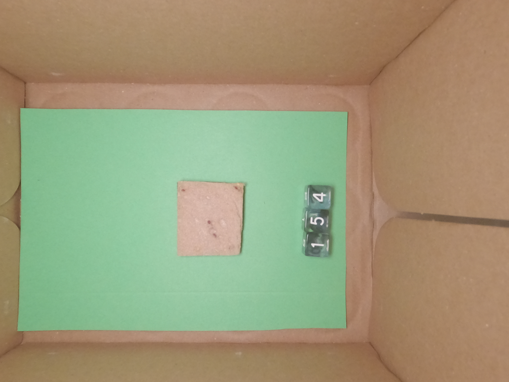

---
output:
  html_document: default
  pdf_document: default
---
## Section I: Introduction and Literature Review
 
### A
Summarize how at least two reference materials relate to the basic scientific principles of your experiment. Each reference material must come from a different source. Be sure to describe how the references provide a foundational background for the experiment you will conduct.

## Section II: Hypothesis

### B

Make a hypothesis(es) to predict the effect of a manipulation of an independent variable on a quantitative dependent variable.

### C

Justify your hypothesis(es) based on prior research and known scientific principles.

## Section III: Method

### D

Describe the independent variable(s); include the following information:
* a description of how the variable(s) will be manipulated
* description of experimental conditions, if applicable

#### Software setup

NixOS R Studio
```
# nix-shell -p rstudio -p pandoc -p texliveFull -p libpng -p pkg-config 
```

Workaround for R 4.3.3
```
# install.packages('lattice')
# install.packages('https://cran.r-project.org/src/contrib/Archive/Matrix/Matrix_1.6-5.tar.gz')
# install.packages("reticulate")
```

#### GoPro setup

#### Image Tests

```{r image_test}
# setwd("pictures/pre")
# knitr::include_graphics("/home/averdow/lab/pictures/pre/test.jpg")
# 
library(magick)
library(tesseract)
library(knitr)
library(dplyr)
library(pander)
library(purrr)

get_sample_pic <- function(path) {
  image <- image_read(path)
  image <- image_crop(image, "1200x1200+1600+1600")
  return(image)
}

get_number_pic <- function(path) {
  number <- image_read(path)
  number <- image_crop(number, "650x1000+2900+1700")
  number <- image_rotate(number, 90)
  number <- image_reducenoise(number)
  number <- image_modulate(number, saturation = 0)
  number <- image_threshold(number,type="white", threshold="70%") 
  number <- image_threshold(number,type="black", threshold="70%") 
  number <- image_negate(number)
  # target 32px for letter height
  number <- image_scale(number, "250")
  return(number)
}

get_number <- function(image) {
  # https://cran.r-project.org/web/packages/tesseract/vignettes/intro.html
  dice <- tesseract(options = list(tessedit_char_whitelist = "123456"))
  text = tesseract::ocr(image, engine = dice)
  return(text)
}


```

```{r}
files <- list.files("pictures/pre", full.names = TRUE)

tmp_path <- function(prefix, path, extension) {
  path <- basename(path)
  path <- gsub("[^/.]*$", extension, path)
  path <- paste(prefix, path, sep="_")
  return(paste("tmp", path, sep="/"))
}

process_file <- function(file) {
  sample_path = tmp_path("sample", file, "png")
  if (!file.exists(sample_path)) {
    sample_pic = get_sample_pic(file)
    image_write(sample_pic, path=sample_path, format="png" )
  }
  
  number_path = tmp_path("number", file, "png")
  if (file.exists(number_path)) {
    number_pic <- image_read(number_path)
  } else {
    number_pic = get_number_pic(file)
    image_write(number_pic, path=number_path, format="png" )
  }
  
  number = get_number(number_pic)
  table_sample = sample_path %>% pander::pandoc.image.return()
  table_number = number_path %>% pander::pandoc.image.return()
    
  df <- data.frame(
    table_sample,
    table_number,
    number,
    basename(file)
  )
  
  return(df)
}


samples <- map_dfr(files, process_file)
colnames(samples) <- c("Sample", "Number", "OCR", "Filename")


samples %>% pander()

```

https://stackoverflow.com/questions/50108763/how-to-insert-images-into-table-in-r-markdown


### E
Describe the dependent variable(s); include the following information:
* a description of how the variable(s)will be quantified, including units of measure
* a description of how the variable(s) will be recorded

###F
Describe at least one external, confounding variable and how it will be controlled. Be sure to justify how your method of controlling that variable will mitigate any confounding effect on observed results.
 
### G
Describe your materials and measurement tools in enough detail that a reader would be able to replicate the experiment.

### H
Describe your experimental procedure in enough detail that a reader would be able to replicate the experiment.
 
## Section IV: Result

### I
Summarize the quantitative data gathered from each experimental manipulation. Be sure to highlight the key findings and trends.

### J
Create a visual representation (i.e., data table, graph, chart) for the data you gathered from each experimental manipulation. Be sure that you choose a method of visual representation that effectively communicates the main findings of your experiment (e.g., exact measurements, trends over time, differences across categories, proportions). Make sure your visual representation clearly represents data for each quantified variable, and be sure to label and align your data accurately. Remember also to choose a scale that fits the range of the data and represent your data points precisely and accurately.
 

## Section V: Conclusions
 

### K
Discuss whether your hypothesis(es) was confirmed, refuted, or partially confirmed. Be sure to describe the observed results supporting your conclusion.

### L
Describe at least one uncontrolled, confounding variable that could have influenced your observed results and any ways the experiment could be improved.
 
### M
Discuss how your experimental results relate to the references presented in the literature review.

## Section VI: Sources
### N
Acknowledge sources, using in-text citations and references, for content that is quoted, paraphrased, or summarized.
